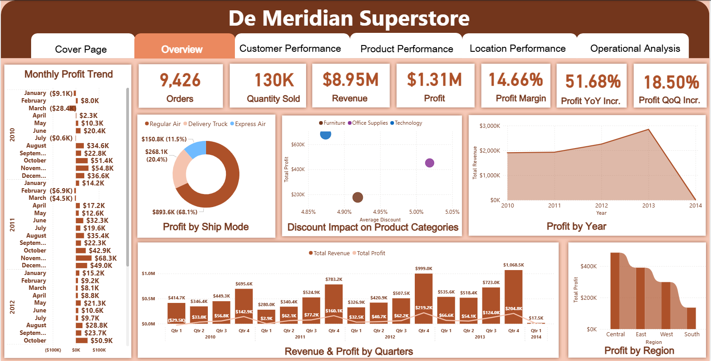
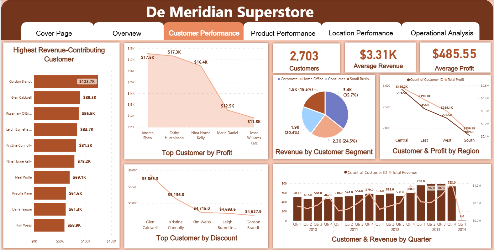
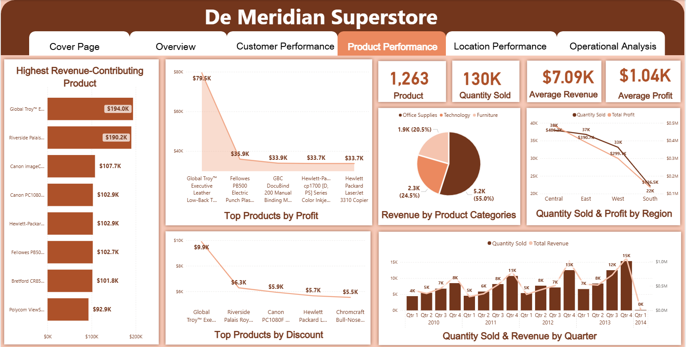
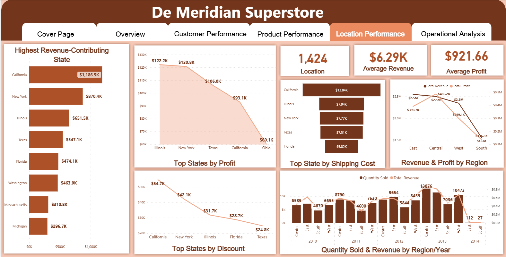
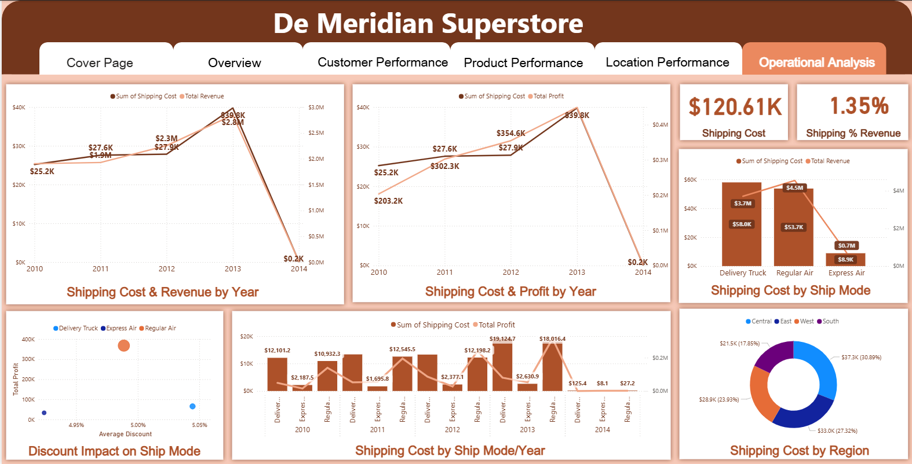

# **De Meridian Superstore — Power BI Business Intelligence Dashboard**

## 📊 **Project Overview**

The ***De Meridian Superstore Dashboard*** is an interactive Business Intelligence solution developed in Microsoft Power BI to transform Superstore business data into actionable insights.

The dashboard provides a multi-dimensional view of business performance across **overall performance, customers, products, locations, and operations**, enabling users to explore trends, identify performance patterns, and support data-driven decision-making.

The project demonstrates the application of **data cleaning, data transformation, data modeling, DAX, KPI development, and interactive data visualization** using Power BI.

---

## 🎯 **Business Objective**

The primary objective of this project is to provide a centralized analytical view of Superstore performance and make it easier to:

* Monitor overall business performance
* Analyze customer performance
* Evaluate product performance
* Compare performance across locations
* Analyze operational and shipping activities
* Identify trends and performance patterns
* Support data-driven business decisions

---

## 🛠️ **Tools & Technologies**

* **Microsoft Power BI**
* **Power Query**
* **DAX (Data Analysis Expressions)**
* **Data Modeling**
* **Data Visualization**
* **Microsoft Excel / Tabular Data**

---

## 📑 **Dashboard Structure**

### 1. Overview

The Overview page provides a high-level summary of business performance through KPI cards and interactive visualizations.

It is designed to give decision-makers a quick understanding of the overall state of the business before drilling into specific areas.

**Key analytical areas include:**

* Overall KPIs
* Sales/revenue performance
* Profitability
* Order activity
* Time-based trends
* Product/category patterns
* Business performance comparisons

---

### 2. Customer Performance

The Customer Performance page focuses on customer-level and customer-segment analysis.

It provides analytical views that help identify:

* High-performing customers
* Customer contribution to business performance
* Customer trends
* Customer distribution
* Revenue/profit patterns
* Differences in customer performance

This page can support customer prioritization and relationship-management decisions.

---

### 3. Product Performance

The Product Performance page analyzes business performance at the product level.

The analysis helps identify:

* Best-performing products
* Low-performing products
* Product sales trends
* Product contribution to revenue
* Profitability patterns
* Discount-related performance
* Differences between products

This provides a basis for product portfolio evaluation and inventory/commercial decisions.

---

### 4. Location Performance

The Location Performance page provides a geographical perspective of business performance.

It allows performance to be examined across different locations and helps identify:

* High-performing locations
* Low-performing locations
* Revenue distribution
* Profitability by location
* Order/activity patterns
* Geographical differences in performance

This can support regional performance monitoring and resource allocation.

---

### 5. Operational Analysis

The Operational Analysis page focuses on operational aspects of the business.

The analysis includes areas such as:

* Shipping activity
* Ship modes
* Operational trends
* Shipping cost
* Order activity
* Relationships between operational variables
* Performance patterns

This page provides an operational perspective beyond traditional sales analysis.

---

## 📈 Key Dashboard Capabilities

The dashboard incorporates multiple Power BI visualization types, including:

* KPI cards
* Bar charts
* Line charts
* Combo charts
* Donut charts
* Ribbon charts
* Scatter charts
* Area charts
* Funnel charts
* Interactive navigation buttons

The combination of these visuals allows users to move from **high-level business performance to detailed analytical views**.

---

## 🔄 Data Analytics Workflow

The project follows a typical Business Intelligence workflow:

```text
Raw Business Data
       ↓
Data Preparation
       ↓
Power Query Transformation
       ↓
Data Modeling
       ↓
DAX Measures
       ↓
KPI Development
       ↓
Interactive Visualizations
       ↓
Business Insights
       ↓
Data-Driven Decisions
```

---

## 🧠 Skills Demonstrated

This project demonstrates practical experience in:

### Data Analytics

* Exploratory data analysis
* KPI analysis
* Trend analysis
* Comparative analysis
* Performance analysis

### Power BI

* Report development
* Interactive dashboard design
* Data visualization
* Page navigation
* KPI cards
* Interactive filtering

### Power Query

* Data transformation
* Data preparation
* Data quality handling

### DAX

* Measure development
* KPI calculations
* Analytical calculations
* Business logic implementation

### Data Modeling

* Relational data modeling
* Table relationships
* Analytical model development
* Single-source analytical reporting

---

## 💼 Business Value

A dashboard such as this can help management move from manually reviewing raw business records to an interactive analytical environment.

Instead of looking at isolated figures, users can investigate performance from multiple perspectives:

**Business → Customer → Product → Location → Operations**

This makes it easier to identify performance patterns and investigate areas that require attention.

---

## 📁 Repository Structure

```text
de-meridian-superstore-power-bi-dashboard/
│
├── README.md
│
├── dashboard/
│   └── De Meridian Superstore Dashboard.pbix
│
├── screenshots/
│   ├── overview.png
│   ├── customer-performance.png
│   ├── product-performance.png
│   ├── location-performance.png
│   └── operational-analysis.png
│
├── documentation/
│   ├── data-model.md
│   ├── dax-measures.md
│   └── data-quality.md
│
└── insights/
    └── business-insights.md
```

---


## 📸 Dashboard Preview

### Overview


### Customer Performance


### Product Performance


### Location Performance


### Operational Analysis


---

## 🚀 Project Outcome

The completed dashboard provides an interactive environment for exploring Superstore performance across multiple business dimensions.

The project demonstrates how **Power BI, Power Query, DAX, data modeling, and visualization** can be combined to convert business data into a decision-support tool.

---

## 👤 Author

**Israel Moses Ubuo**

Data Scientist | Data Analyst | Applied Physics Graduate

**Core Interests:**
Data Analytics • Data Science • Business Intelligence • Energy • Industrial Applications

---

## ⭐ Portfolio

This project is part of my data analytics portfolio, demonstrating practical application of Business Intelligence and analytical techniques to real-world-style business data.
